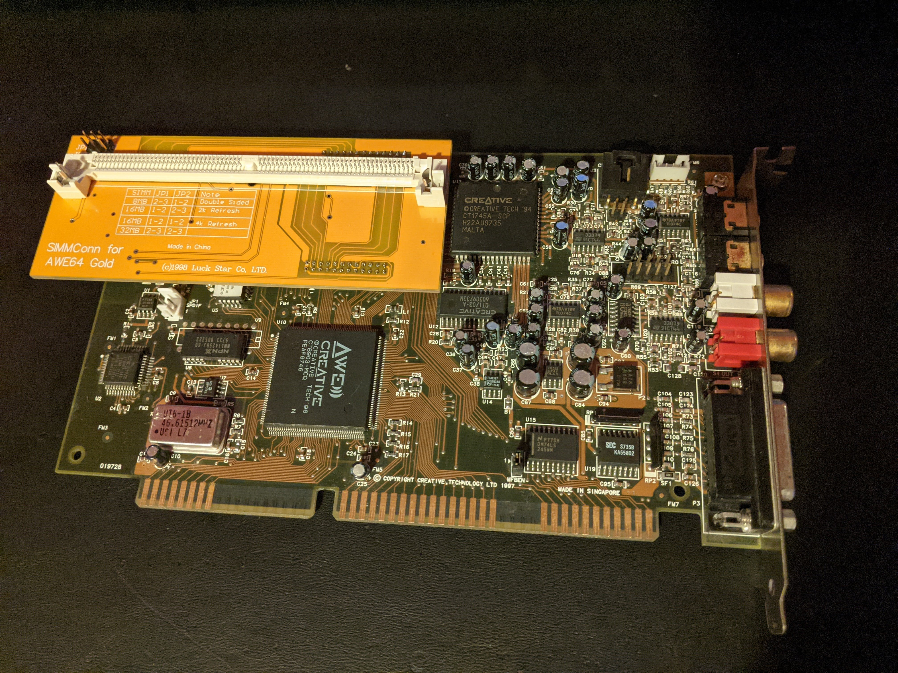

# AWE64-SIMMconn
A memory expansion for the AWE64 Value and AWE64 Gold.

## Info
Original design from https://simmconn.tripod.com/ -- all credit to Xu Wang for creation of this wonderful piece of hardware and for providing the original files on the website.
\
\
This respository contains the Altium converted project from the original Protel files. There are also updated gerber files for use with a modern PCB fabricator. I included a new BOM as well, with a tested alternative to the original PAL, using an Atmel ATF16V8C-7JU. 
\
\
Flashing the PAL, it is recommended to use the specific VALUE or GOLD *.jed file. The ALL file is listed as experimental.
\
\
Tested and working on my AWE64 Gold. It can be picky about your choice of RAM, so test out a few different SIMMs. 32MB SIMMs are limited to 28MB. (E-mu8000 limitation)
